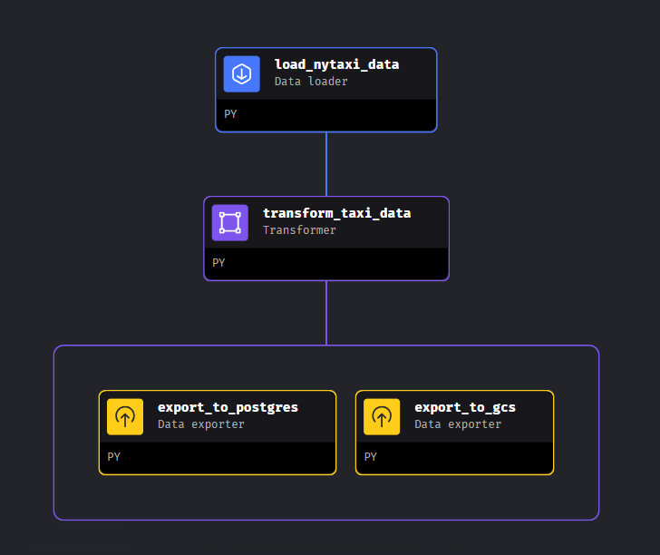

# What is MAGE?

Mage is a hybrid framework that combines the best of both worlds: the flexibility of notebooks with the rigor of modular code.

* Extract and synchronize data from 3rd party sources.
* Transform data with real-time and batch pipelines using Python, SQL, and R.
* Load data into your data warehouse or data lake using our pre-built connectors.
* Run, monitor, and orchestrate thousands of pipelines without losing sleep.

For more details see [MAGE documentation](https://docs.mage.ai/introduction/overview)

# Homework

The goal of this homework is to construct an ETL pipeline that loads the data, performs some transformations, and writes the data to a database and Google Cloud. 
You can reproduce my solution following the steps below.

## Technologies

The technologies I chose to carry out the homework are:

Programming language:
* Python

Containerization:
* Docker
* Docker compose

Orchestration:
* MAGE

Cloud:
* Google Cloud Platform

Database:
* PostgreSQL

## Steps

### Step 1: Docker Compose

First of all I choose tu run all i need (MAGE project, PostgresSQL and also PGAdmin) with Docker Compose. In the [docker](https://github.com/Mateo-Omeri/dezoomcamp/tree/main/%5BWEEK%202%5D%20Orchestration-MAGE/mage) repository you can see all you need to run what you need for the homework. 
With regard to MAGE project i used the [template](https://github.com/mage-ai/compose-quickstart) offered by MAGE community. Be sure to rename dev.env file to .env and to not push it to your GitHub repository. This file is where you can put all configuration details for your MAGE project, PostgresSQL and PGAdmin.

PGAdmin is not necessary for this homework, I used only to check that the data was correctly exported to Postgres database

All you need to do now is run the command:

```
    docker compose up
```
and go to localhost:6789 for the MAGE UI interface of your project.

### Step 2: GCP

You need to prepare GCP environment. If you do not already have a Service Account, you need to create one with, at least, the permission to write into the buckets. Then create a JSON key of that account and put it to the folder (DO NOT PUSH IT INTO GITHUB, CHECK IT ALWAYs YOUR .gitignore FILE). See this [tutorial](https://www.youtube.com/watch?v=00LP360iYvE&list=PL3MmuxUbc_hJed7dXYoJw8DoCuVHhGEQb) for more details.

### Step 3: MAGE pipeline

Now it's time to construct the ETL pipeline, to achieve our goal!

How pipeline will look like in the end:



#### MAGE config

First of all, to connect to your Postgres database you need to update the io_config.yaml file. The io_config YAML file contains the information and credentials required to access databases, data warehouses, and data lakes.
Simply you have to add at the end of file this snippets:

```
dev:
  POSTGRES_CONNECT_TIMEOUT: 10
  POSTGRES_DBNAME: {{ env_var('POSTGRES_DBNAME') }}
  POSTGRES_SCHEMA: {{ env_var('POSTGRES_SCHEMA') }} # Optional
  POSTGRES_USER: {{ env_var('POSTGRES_USER') }}
  POSTGRES_PASSWORD: {{ env_var('POSTGRES_PASSWORD') }}
  POSTGRES_HOST: {{ env_var('POSTGRES_HOST') }}
  POSTGRES_PORT: {{ env_var('POSTGRES_PORT') }}

```

The variables are always those of the .env file.

#### MAGE Blocks

A block is a file with code that can be executed independently or within a pipeline. Together, blocks form a Directed Acyclic Graph (DAG), which we call pipelines. A block won’t start running in a pipeline until all its upstream dependencies are met. There are 8 different type of blocks. For this homework i used 3 type of them:

* Data Loader: write your code for fetching data from a remote source or loading it from disk. The object that is returned from the decorated function (e.g. load_data_from_api) will be made available in all blocks that depend on this block. For more details see docs on [Data_Loader](https://docs.mage.ai/design/blocks/data-loader)

* Transformer: use these blocks to clean, transform, and enhance data from other blocks. For more details see docs on [Transformer](https://docs.mage.ai/design/blocks/transformer)

* Data exporter: once you’re done transforming your data, write code in these types of blocks to store that data or to train models and store those models elsewhere. For more details see docs on [Data_Exporter](https://docs.mage.ai/design/blocks/data-exporter)

See my [code](https://github.com/Mateo-Omeri/dezoomcamp/tree/main/%5BWEEK%202%5D%20Orchestration-MAGE/mage/pipeline_code)
 


